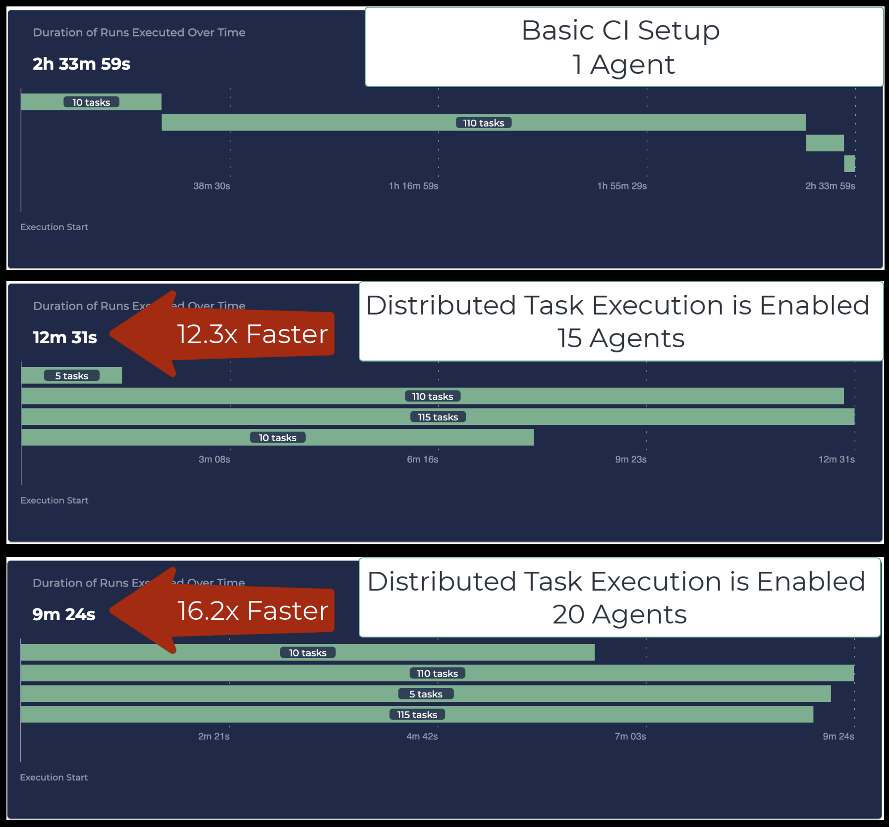
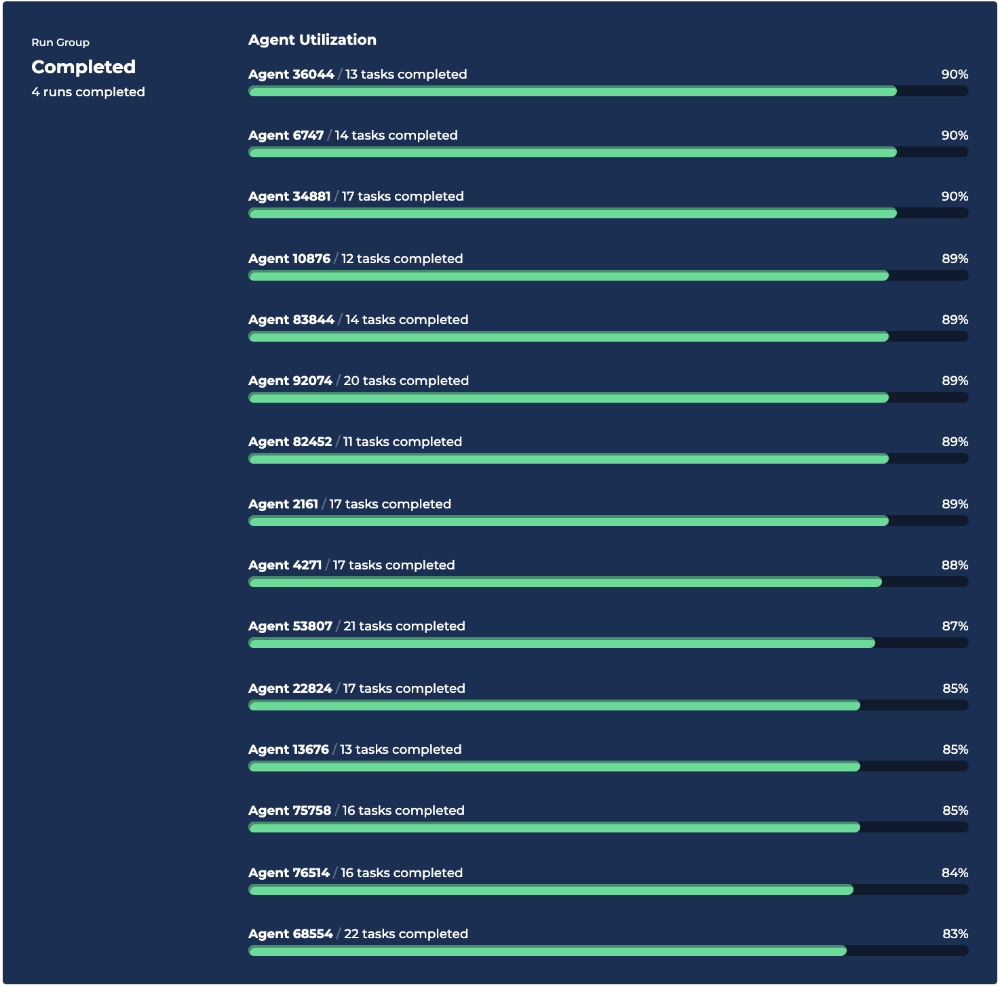
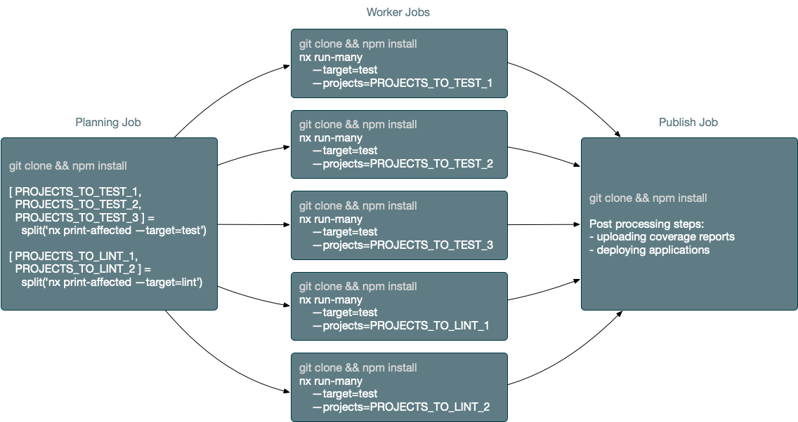
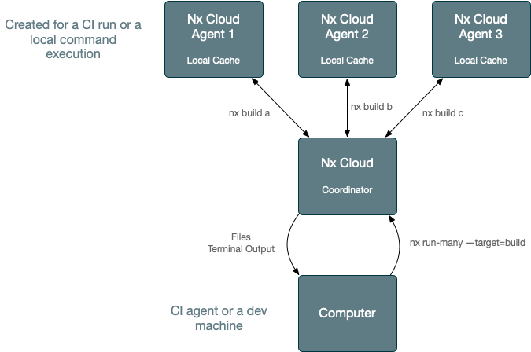
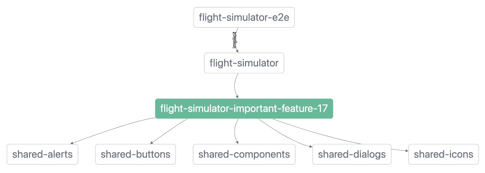

# Nx Distributed Task Execution (DTE) Example/Benchmark

#### On how to make your CI 16 times faster with a small config change

## Repo Contains

* 5 shared buildable packages/libraries with 250 components each
* 5 Next.js applications built out of 20 app-specific libraries. Each app-specific lib has 250 components each. Each
  library uses the shared components.

## Results



This is a complementary benchmark
to [this one measuring local workspace analysis and cache restoration of Nx and Turborepo](https://github.com/vsavkin/large-monorepo/)
. Nx is 9.4 times faster.

The reason why this repo isn’t a comparison to, say, Turborepo (or any other monorepo tool used by the JS community) is
that no other tool, to my knowledge, supports distributed task execution.

Comparisons are easy to understand. If Tool A is 9 times faster than Tool B, then A is better. But if there is no B,
it’s hard to explain why A is really cool. 

Local and remote caching are useful, but only Distributed Task Execution is truly transformative. Unfortunately, unless you worked at Google/Facebook/etc you won't know that that's the case. This repo is my attempt to show why Distributed Task Execution (DTE) is a game changer for a
lot of projects.

## Analysing the Results

Enabling Distributed Task Execution and allocating 15 agents resulted in 12.3x improvement. Note this is a small config
change (see below): we didn't have to rewrite our CI or change anything about applications.

And the dev ergonomics remained the same:

* All build artifacts and coverage reports end up on the main agent
* All logs are in one place
* **The dev ergonomics of using 15 agents is exactly the same as using a single agent.**

If we think the results aren't good enough, we can allocate more agents, and Nx will intelligently redistribute the work
between them. For instance, a 1-line config change adding 5 extra agents reduces the time to 9m 24s. You can see in the
picture above, that if we allocate more agents, the CI time will get reduced to about 7m.

### Intelligently Redistribute?

Nx knows what commands your CI is running. It also knows how many agents you typically use, and how long each task in
your workspace typically takes. Nx uses this information to create an execution plan. For instance, it knows that tests
do not depend on each other, whereas we need to build the shared libraries first. Nx knows that the theoretical limit of
how fast your CI can get is `slowest build of shared lib + slowest build of app`, so it will prioritize building shared
libs to unblock the apps.

This results in a somewhat even utilisation:
<br>

<br>

After you run your CI a couple of times, Nx will learn stats about your workspace, and your CI will be more or less as
fast as it can be given the provided agents. If you change the number of agents, Nx will rebalance the work. As you keep
changing your repo, Nx will keep its understanding of it up to date and will keep your CI fast. 

**This all happens without you having to do anything.**


### What About Remote Caching?

Nx supports remote computation caching, but it doesn't help this particular case. Remote caching ONLY helps with the average case, where some tasks are cached and some are not. In the worst case scenario nothing is cached. The only way to make the worst case scenario fast is to distribute. **And you have to distribute.** If you average CI time is 10 mins, but your worst case CI time (which say happens every couple of days) is 4 hours, it is still unusable.


## Understanding Two Approaches to Distribution

**Non-trivial repos always use more than one agent in CI to verify PRs. The bigger the repo is, the more agents you
use (our clients’ biggest repos use 100+ agents for every CI run).**

There are two ways to distribute work across agents: **Sharding/Binning** and **Distributed Task Execution**

### Approach 1: Sharding/Binning

Binning is an approach to distribution where the planning job divides the work into equally-weighted bins, one for each
worker job. Then every worker executes the work prepared for it. After that the post-verification job runs. This
requires you to completely change your CI setup.

<br>

<br>

### Approach 2: Distributed Task Execution

Distributed Task Execution is an approach where any command can be distributed and run on N machines instead of a single
machine without changing the dev ergonomics or other assumptions about that command. This doesn't require you to change
your CI setup.

<br>

<br>

Sharding/binning works for smaller repos (up to 10 agents), but even at that scale it has a lot of problems:

- Agent utilization is uneven, so the CI is slower. And it requires manual rebalancing of tasks between agents.
- Bad dev ergonomics (e.g., 10 different logs with potential failures).
- It doesn't work for builds.

### Sharding Doesn't Work for Builds?

The CI has to build shared libraries first because Next.js applications consume those libraries
from "dist". 



You cannot shard non-flat graphs, so you would have to rebuild shared libraries on all agents (which would make your CI much slower). If most of
your libraries are buildable, it won’t work at all.

[Read more about binning/sharding and
DTE](https://blog.nrwl.io/distributing-ci-binning-and-distributed-task-execution-632fe31a8953).

### Could We Use Binning/Sharding?

If we were to change the repo to use binning/sharding, we would end up with:
* 500-line complex CI config
* Uneven utilization (so the CI time would be slower given the same number of agents)
* Bad DX (we would see 20 different commands instead of 4 we logically have). Even with 20 agents, the sharding setup is not really usable.

## Why No Other Build System Uses DTE?

Given everything mentioned, using distributed task execution is clearly much better. So why only Nx supports it, whereas so many tools support remote caching?

Remote caching is relatively easy to build (took me about 3 days to get the first working version up and running), and
distributed task execution is hard (took us about a year), but the payoff is huge.

And there are several build systems supporting DTE. For instance, Bazel and Buck support DTE. They are used at Google and Facebook and some form of DTE is the only way to scale large repo. I have a lot of respect for the teams working on them but, if I’m honest, they don’t work well for the JS ecosystem.

To be honest, a lot of Nx work is taking cool ideas developed by those talented teams and making them super easy to use.


## Extra Notes

### Enabling DTE

Without DTE, our CI config looks like this:

```yaml
- run: npm install
- run: npx nx affected --target=build --parallel=1
- run: npx nx affected --target=test --parallel=1
- run: npx nx affected --target=lint --parallel=3
- run: npx nx affected --target=e2e --parallel=1
```

With DTE, the main job looks very similar (we use `parallel-bash-commands` to run the commands in parallel, which is
optional. If we didn't use it, the main job would be the same).

```yaml
- name: Run verification
  uses: JamesHenry/parallel-bash-commands@v0.1
  with:
    cmd1: npx nx affected --target=build --parallel=1
    cmd2: npx nx affected --target=test --parallel=1
    cmd3: npx nx affected --target=lint --parallel=3
    cmd4: npx nx affected --target=e2e --parallel=1
```

The only thing we have to do is to provision agents:

```yaml
agents:
  name: Nx Cloud Agents
  runs-on: ubuntu-latest
  timeout-minutes: 60
  strategy:
    matrix:
      agent: [ 1, 2, 3, 4, 5, 6, 7, 8, 9, 10, 11, 12, 13, 14, 15, 16, 17, 18, 19, 20 ]
  steps:
    - uses: actions/checkout@v2
    - uses: actions/setup-node@v1
    - run: npm install
    - run: npx nx-cloud start-agent
```

### Using Nx Plugins to Build Next Apps

This repo uses the `@nrwl/next` plugin to build the Next.js apps. The plugin wraps the Next.js CLI and remaps path mappings such that shared libraries are consumed from "dist" when building the apps but point to source when you work in the editor. 

**You don't have to use the Next.js plugin**. You can also use npm scripts to build the Next.js and set up yarn workspaces to consume shared libs (similar to [this repo](https://github.com/vsavkin/large-monorepo/)). Your dev experience will be worse because your editor navigation and refactoring won't work correctly. This is the main reason why we have Next.js plugin in the first place: to make the Next.js dev experience good in monorepos.

**Regardless whether you use plugins or npm scripts, distributed task execution will work exactly the same way, the performance numbers, and everything else this README talks about, will apply in exactly the same way.**


