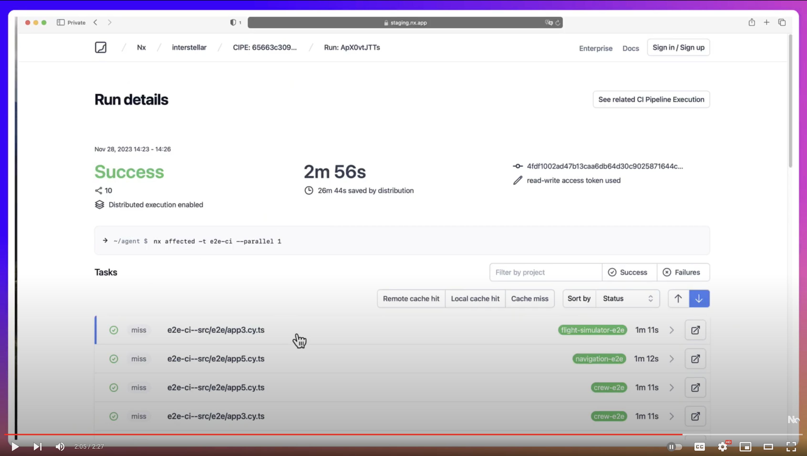
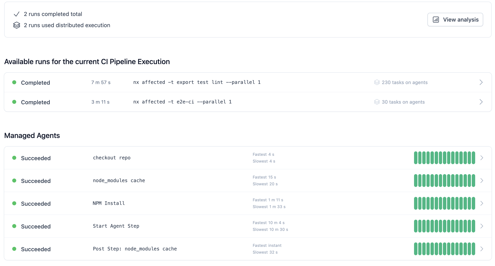
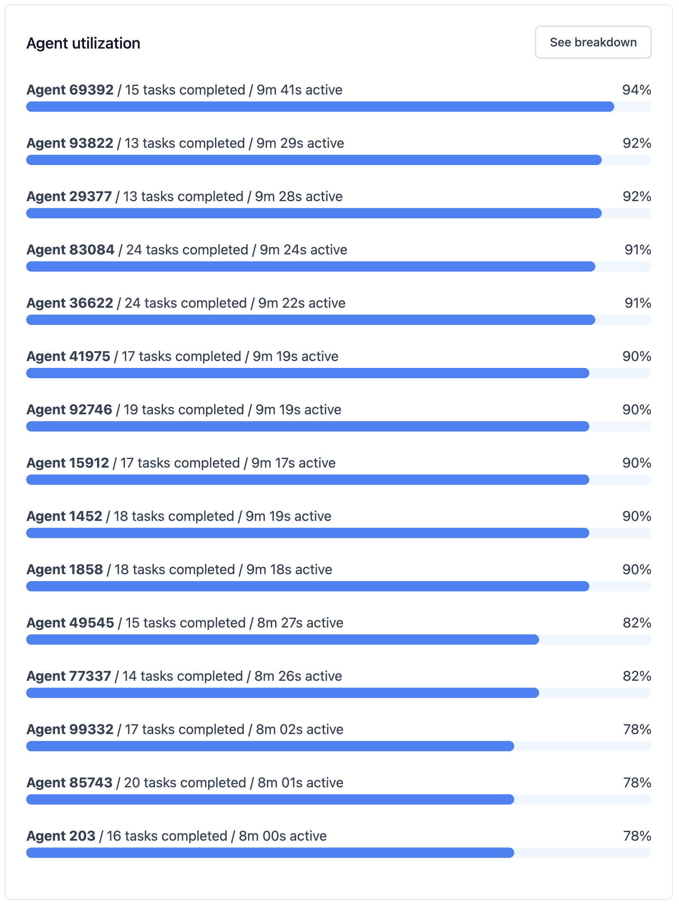

# Nx Agents Demo
4
#### On how to make your CI 10 times faster with a single line change

This repo shows how using Nx Managed Agents you can distribute your CI reducing its time from hours to minutes.

## Video
<br>
<a href="https://youtu.be/KPCMg_Dn0EoE">

</a>
<br>

## Repository

* 5 shared buildable packages/libraries with 250 components each
* 5 Next.js applications built out of 20 app-specific libraries. Each app-specific lib has 250 components each. Each library uses the shared components.

## Baseline

The CI for this repo is implemented as follows:

```
npx nx affected -t export test lint --parallel 1 && npx nx affected -t e2e --parallel 1 
```

The job takes 87 minutes.

<br>

<br>

## Enabling Distribution

### Distribution

To enable distribution we need to make sure our repo is connected to Nx Cloud (which we can do by running `nx connect`). After that we need to add the following line to our CI config:

```
npx nx-cloud start-ci-run --distributes-on="15 linux-medium-plus-js" --stop-agents-after="e2e-ci"
```

This informs Nx that we can distribute commands using 15 linux VMs.

### Splitting E2E tests

Some Nx plugins (e.g., Cypress and Playwright) can automatically split expensive tasks into smaller, cheaper tasks, than can run in parallel. This means that even if you have a single suite of Cypress tests that takes, say, 10 minutes to run. Nx is able to split it into smaller tasks, which can take, say 1 minute to run each.

We enable that we need to change `npx nx affected -t e2e --parallel 1` to `npx nx affected -t e2e-ci --parallel 1`.

The updated job takes 9 minutes.

<br>

<br>

Machine utilization was even:

<br>

<br>

## What About Remote Caching?

Nx supports remote computation caching, but it doesn't help this particular case. Remote caching ONLY helps with the average case, where some tasks are cached and some are not. In the worst case scenario nothing is cached. The only way to make the worst case scenario fast is to distribute. **And you have to distribute.** If you average CI time is 10 mins, but your worst case CI time (which say happens every couple of days) is 4 hours, it is still unusable.

## Intelligent Distribution

Nx knows what commands your CI is running. It also knows how many agents you typically use, and how long each task in
your workspace typically takes. Nx uses this information to create an execution plan. For instance, it knows that tests
do not depend on each other, whereas we need to build the shared libraries first. Nx knows that the theoretical limit of
how fast your CI can get is `slowest build of shared lib + slowest build of app`, so it will prioritize building shared
libs to unblock the apps.

After you run your CI a couple of times, Nx will learn stats about your workspace, and your CI will be more or less as
fast as it can be given the provided agents. If you change the number of agents, Nx will rebalance the work. As you keep
changing your repo, Nx will keep its understanding of it up to date and will keep your CI fast.

Nx can also size your PR to see how many agents will be required to run the CI and use an appropriate number of agents.

**This all happens without you having to do anything.**

## Other Benchmarks

This is a complementary benchmark to [this one measuring local workspace analysis and cache restoration of Nx and Turborepo](https://github.com/vsavkin/large-monorepo/)
. Nx is 6 times faster.

The reason why this repo isn’t a comparison to, say, Turborepo or any other monorepo tool is that no other tool used by the JS community (including Turborepo) supports distribution.

Comparisons are easy to understand. If Tool A is 9 times faster than Tool B, then A is better. But if there is no B, it’s hard to explain why A is really cool.

Local and remote caching are useful, but distribution is truly transformative. Unfortunately, unless you worked at Google/Facebook/etc you won't know that that's the case. This repo is my attempt to show why distribution is a gamer changer for a lot of projects.


